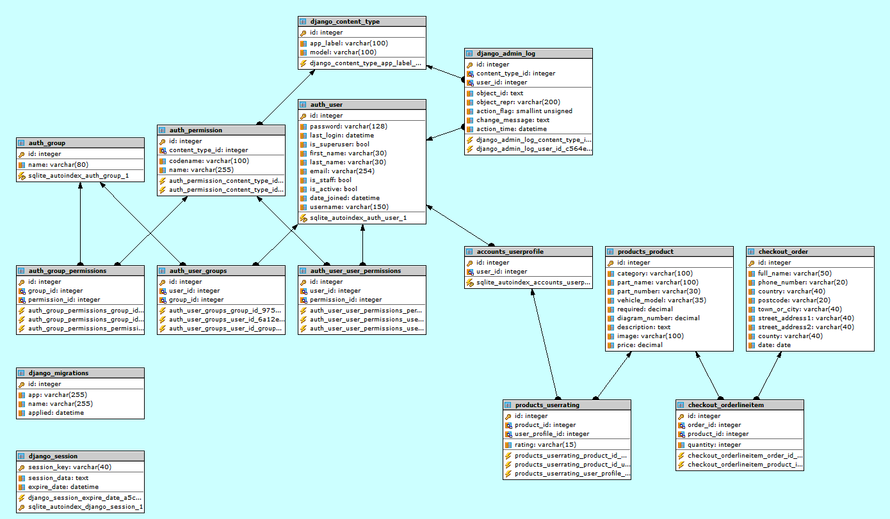

[](https://travis-ci.org/bennettpe/fullstack-frameworks-django-website)

# Full Stack Frameworks with Django Milestone 5 Project

## eCommerce Webshop
Heroku App: https://fullstack-frameworks-project.herokuapp.com <br>
Heroku git: https://git.heroku.com/fullstack-frameworks-project.git <br>
GitHub: https://github.com/bennettpe/fullstack-frameworks-django-website.git <br>

This is the milestone project that I have created for the **“Full Stack Frameworks with Django”** module, which is part of  “Full Stack Web Development Course” offered by Code Institute.

## Project Brief
This project will be built using knowledge which have been learnt within the Full Stack Frameworks with Django module and the other previous eight modules.

For project brief see [Project Brief documentation](static/wireframe/FULL STACK FRAMEWORK WITH DJANGO PROJECT BRIEF.pdf) <br>

### My Project Overview
A web application for classic car parts , parts for the webshop have been gathered from the following website [**scparts.co.uk**](https://www.scparts.co.uk/sc_en/british-cars/triumph/triumph-spitfire-mkiii-mkiv-and-1500-1967-1980.html)

* The user has a choice to do the following  
  * Register an account with a username and password
  * Log-in with a registered username and password
  * Reset password with a registered username
  * Search products (by 12 parts categories)
  * View parts by parts diagrams
  * Add products to shopping cart
  * Adjust quantity of parts in shopping cart
  * Pay for products in shopping cart checkout 
  * Vote to like / dislike products
  * Contact us via contact page
  * View websits satistics charts 

## UX  

### Who is this website for ?  
* A website that allows users to view and purchase classic car parts.

### What is it they want to achieve ?
To provide a online eCommerce wbsite that users must be able to do the following
    
* Add products to use Stripe shopping cart checkout (only if Logged in).
* Adjust quantity in Shopping cart
* Add User via registration and authentication processes.
* Users to vote to like or diskliked products.
* View website graphs
* Contact us via contact page
* Ensure there's a README.md.

### How the project is best way to achieve these things ? 
* Create Web Application (Create New Ecommerce multi app Django web application.)
* Include Ecommerce functionality (Create app(s) to use Stripe (Shopping cart checkout)
* Include Form validation (Create form(s) to allow users to Create / Edit models in backend)
* Include Graphs (Create graphs for website satistics)
* Include Up / Down voting (Users could upvote/downvote i.e. parts they like/dislike)
* Include Version Control (Use Git & GitHub)
* Test code (Make sure code is extensively tested and documented in READMe.md)
* Backend Logic (Create backend to include (whenever relevant) third-party Django / Python framework)
* Database connection (Connect DB using Django Object-Relational Mapper (ORM)
* Frontend Logic (Create frontend to include JavaScript logic)
* User Interface (UI) (Create UI to include Bootstrap or media queries)
* Deploy Final Version (Use Heroku as hosting platform)
* Ensure there’s a README.md (A project submitted without a README.md file will FAIL)

### Project Planning & Wireframe Mockup 
For planning see [Planning documentation](static/wireframe/My Full Stack Frameworks with Django Milestone Project Planning.pdf) <br>
For wireframe see [Wireframe documentation](static/wireframe/My Full Stack Frameworks with django wireframe.pdf)

### Database Schema
My SQLite3 / Postgres database consists of the following tables
* accounts_userprofile
* checkout_order
* checkout_orderlineitem
* products_product
* products_userting

   
Diagram of website database schema


### Functional Flow
Users will access website via ****     
On the navbar there are the following eight icons (Home, About, Parts, Register, Log in, Cart, Contact, Charts) and on the page there are Register and log in buttons.    
Unregistered users can search parts by, clicking on parts which then shows a parts category dropdown.
register button allows uses to register username and password.   
sign in button allows users to sign in.
once signed in the login and register icon are removed and a Log out icon is shown with userid.
when logging out a message is daisplayed saying "You have successfully been logged out".
when logging in as "admin" a icon is shown to access the django admin panel.

   
Diagram of website functional flow  

### Technologies Used
Technologies used in the construction of this project include,  
* [Badel](https://pypi.org/project/Babel/) is a collection of tools for internationalizing Python applications.
* [Bootstrap](https://getbootstrap.com/) is a framework for building responsive, mobile-first websites.
* [Bootstrap-Magnify](https://github.com/marcaube/bootstrap-magnify) is a small js plugin to enhance porte-folios and image galleries.
* [Bootswatch](https://bootswatch.com/sandstone/) is a free bootstrap theme.
* [Boto3](https://pypi.org/project/boto3/) is a software development kit (SDK) designed to improve the use of the Python programming language in AWS.
* [Botocore](https://pypi.org/project/botocore/) is a Low-level, data-driven core of boto 3.
* [Certifi](https://pypi.org/project/certifi/) is a Python package for providing Mozilla's CA Bundle.
* [Chardet](https://pypi.org/project/chardet/) is a Universal encoding detector for Python 2 and 3
* [Chrome Developer Tools]() is a set of web developer tools built directly into the Google Chrome browser.
* [Cloud9 IDE](https://aws.amazon.com/cloud9/) is a cloud-based integrated development environment (IDE) used as development environment workspace.
* [CSS3](https://www.w3.org/Style/CSS/Overview.en.html) is a simple mechanism for adding style (e.g., fonts, colors, spacing) to Web documents.
* [Docutils](https://pypi.org/project/docutils/) is a Python Documentation Utilities
* [Django](https://www.djangoproject.com/download/) is a Python-based open-source web framework, which follows the model-template-view architectural pattern.
* [Django-Forms-Bootstrap](https://github.com/pinax/django-forms-bootstrap) is a simple bootstrap filter for Django forms.
* [Django-Storages](https://pypi.org/project/django-storages/) is a collection of custom storage backends for Django.
* [Django-Phonenumber-Field](https://pypi.org/project/django-phonenumber-field/) is a Django library which interfaces with phonenumbers to validate, convert phone numbers.
* [Phonenumbers](https://github.com/daviddrysdale/python-phonenumbers) is a Python port of Google's libphonenumber library 
* [Dj-database-url](https://pypi.org/project/dj-database-url/) is a Django utility to utilize the 12factor inspired DATABASE_URL env va to configure your Django app.
* [Font Awesome](https://fontawesome.com/) is a font and icon toolkit.
* [Git](https://git-scm.com/) open source distributed version control system.
* [GitHub](https://github.com/) is a Web-based hosting service for version control using Git.
* [GitIgnore](https://www.gitignore.io/) is a web service designed to help you create .gitignore files for your Git repositories.
* [Gunicorn]() is a Python WSGI HTTP Server for UNIX.
* [Heroku](https://www.heroku.com/) lets you deploy, run and manage applications written in Ruby, Node.js, Java, Python, Clojure, Scala, Go and PHP.
* [Highcharts](https://www.highcharts.com/) is a software library for charting written in pure JavaScript.
* [HTML5](https://www.w3.org/TR/html52/): is code that describes web pages.
* [Idna](https://pypi.org/project/idna/) is a Internationalized Domain Names in Applications (IDNA)
* [JavaScript](https://www.javascript.com/) JavaScript is a dynamic computer programming language. And most commonly used as a part of web pages.
* [Jinga2](http://jinja.pocoo.org/) a full featured template engine for Python.
* [Jmespath](http://jmespath.org/) is a query language for JSON.
* [Pencil](https://pencil.evolus.vn/) is an open-source GUI prototyping tool used to create Wireframe mockup.
* [Pillow](https://pypi.org/project/Pillow/) is a Pillow is the friendly PIL fork.
* [Psycopg2](http://initd.org/psycopg/) is a popular PostgreSQL adapter for the Python. 
* [Python 3.4.3](https://www.python.org/) is a scripting language.
* [Pytz](https://pypi.org/project/pytz/) is a World timezone definitions, modern and historical.
* [Requests]() is a Python HTTP for Humans.
* [S3transfer](https://pypi.org/project/s3transfer/) is a An Amazon S3 Transfer Manager
* [Slack](https://code-institute-room.slack.com/messages) is a collaboration hub that connects your organization.
* [Python-dateutil]() is a Extensions to the standard Python datetime module.
* [Sqlite3](https://www.sqlite.org/index.html) is a C-language library that implements a SQL database engine.
* [Sql Postgres](https://www.postgresql.org/)is a powerful, open source object-relational database system
* [Stripe](https://stripe.com/gb) is a powerful and flexible tools for internet commerce.
* [Travis](https://travis-ci.com/) is a hosted continuous integration service used to build and test software projects hosted at GitHub.
* [Urllib3](https://pypi.org/project/urllib3/) is a HTTP library with thread-safe connection pooling, file post, and more.

### Git
Make sure once the workspace has been created in Cloud9 you create the following for git by typing the following commands,  
* `git init` to create a empty Git repository. <br>
* Create `.gitignore` which specifies intentionally untracked files to ignore <br>
* Add to `.gitignore` file the ignore file(s) for the environments you are using in your workspace i.e. `Cloud9`, `Django`, `Python` by copying ignore files from [GitIgnore](https://www.gitignore.io/) <br>
* Also make sure you add your own personal non environmental file you would like to be excluded as well at the top of the file.

<details>
<summary>
<a> Step1 Creating Django Project Enviroment </a>
</summary>
<p></p>

## Step1 Creating Django Project Enviroment 
1. Create the project Clould9 Workspace **fullstack-frameworks-django-project** <br>

2. Install Django 1.11.20 <br>
    ```python 
    sudo pip3 install django==1.11.20 
    ``` 
    This installs **django 1.11.20** and **pytz 2018.9** 
    
    output from bash terminal 
    ```python
    bennettpe:~/workspace $ sudo pip3 install django==1.11.20
    Downloading/unpacking django==1.11.20
    Downloading Django-1.11.20-py2.py3-none-any.whl (6.9MB): 6.9MB downloaded
    Downloading/unpacking pytz (from django==1.11.20)
    Downloading pytz-2018.9-py2.py3-none-any.whl (510kB): 510kB downloaded
    Installing collected packages: django, pytz
    Successfully installed django pytz
    Cleaning up...
    ```

3. Initalise Git repository <br>
    ```python
    git init
    ```
    output from bash terminal
    ```python
    bennettpe:~/workspace $ git init
    Initialized empty Git repository in /home/ubuntu/workspace/.git/
    ```
    
4. Create `.gitignore` and `README.md` files 

5. Create `requirements.txt` file <br>
   ```python
   sudo pip freeze --local > requirements.txt
   ```
   output from bash terminal
   ```python
   bennettpe:~/workspace (master) $ sudo pip freeze --local > requirements.txt
   ```
6. Go to Github https://github.com and Create new repository called `fullstack-frameworks-django-website` 
   output from bash terminal
   ```python
   bennettpe:~/workspace (master) $ git add .
   bennettpe:~/workspace (master) $ git commit -m "first commit"
   [master (root-commit) 7fd944a] first commit
    4 files changed, 71 insertions(+)
    create mode 100644 .gitignore
    create mode 100644 README.md
    create mode 100644 WORKING.md
    create mode 100644 requirements.txt
   bennettpe:~/workspace (master) $ git remote add origin https://github.com/bennettpe/fullstack-frameworks-django-website.git
   bennettpe:~/workspace (master) $ git push -u origin master
   Username for 'https://github.com': bennettpe
   Password for 'https://bennettpe@github.com': 
   Counting objects: 5, done.
   Delta compression using up to 8 threads.
   Compressing objects: 100% (4/4), done.
   Writing objects: 100% (5/5), 1.40 KiB | 1.40 MiB/s, done.
   Total 5 (delta 0), reused 0 (delta 0)
   To https://github.com/bennettpe/fullstack-frameworks-django-website.git
    * [new branch]      master -> master
   Branch master set up to track remote branch master from origin.
   ```
   Heroku Git URL https://git.heroku.com/fullstack-frameworks-project.git

7. Go to Heroku https://dashboard.heroku.com/apps and <br> Create new app called `fullstack-frameworks-project` <br>
   Click on `Create New App` fill in `App name`   
   Click on `Choose a region` and select `Europe`   
   Click on `Create app` button

8. Install Gunicorn
   ```python
   sudo pip3 install gunicorn
   ```
   This installs **gunicorn 19.9.0** 
   
   output from bash terminal
   ```python
   bennettpe:~/workspace (master) $ sudo pip3 install gunicorn
   Downloading/unpacking gunicorn
   Downloading gunicorn-19.9.0-py2.py3-none-any.whl (112kB): 112kB downloaded
   Installing collected packages: gunicorn
   Successfully installed gunicorn
   Cleaning up...
   ```

9. Install Psycopg2
   ```python
   sudo pip3 install psycopg2
   ```
   This installs **psycopg2 2.8**  

   output from bash terminal
   ```python
   bennettpe:~/workspace (master) $ sudo pip3 install psycopg2
   Downloading/unpacking psycopg2
   Downloading psycopg2-2.8.tar.gz (367kB): 367kB downloaded
   Running setup.py (path:/tmp/pip_build_root/psycopg2/setup.py) egg_info for package psycopg2
     /usr/lib/python3.4/distutils/dist.py:260: UserWarning: Unknown distribution option: 'project_urls'
       warnings.warn(msg)
     /usr/lib/python3.4/distutils/dist.py:260: UserWarning: Unknown distribution option: 'python_requires'
       warnings.warn(msg)
    
   Installing collected packages: psycopg2
   Running setup.py install for psycopg2
     building 'psycopg2._psycopg' extension
     
   ....    
   Successfully installed psycopg2
   Cleaning up...    
   ```
10.  Create `requirements.txt` file <br>
   ```python
   sudo pip freeze --local > requirements.txt
   ```
   output from bash terminal
   ```python
   bennettpe:~/workspace (master) $ sudo pip freeze --local > requirements.txt
   ``` 

11. Create a new PostgreSQL database on Heroku
    Click on `Resources`   
    Scroll down to `Add-ons` type `Postgres` select `Heroku Postgres` select `Hobby Dev - Free plan` click on `Provision` button
    This creates a empty database

12. Install dj-database-url
    ```python
    sudo pip3 install dj-database-url
    ```
    This installs **dj-database-url 0.5.0** 

    ouput from bash terminal
    ```python
    bennettpe:~/workspace (master) $ sudo pip3 install dj-database-url
    Downloading/unpacking dj-database-url
    Downloading dj_database_url-0.5.0-py2.py3-none-any.whl
    Installing collected packages: dj-database-url
    Successfully installed dj-database-url
    Cleaning up...
    ```

13. Create Django project called `Triumphant-Triumphs` in the root directory by adding .
    ```python
    django-admin startproject triumphant_triumphs .
    ```
 
     ouput from bash terminal
    ```python
    bennettpe:~/workspace (master) $ django-admin startproject triumphant_triumphs .  
    ```
    
    The following django files have been created
    ```
    fullstack-frameworks-django-project
    │
    ├── triumphant_triumphs
    │   │
    │   ├── __init__.py   # An empty file that tells Python that this directory should be considered a Python package. 
    │   ├── settings.py   # Settings/configuration for this Django project.
    │   ├── urls.py       # The URL declarations for this Django project; a “table of contents” of your Django-powered site.
    │   └── wsgi.py       # An entry-point for WSGI-compatible web servers to serve your project.
    │
    └── manage.py         # A command-line utility that lets you interact with this Django project in various ways.
    ```

14. Open `settings.py` and add the following to `ALLOWED_HOSTS` to allow Cloud9 as allowed host
    ```python
    ALLOWED_HOSTS = [os.environ.get('C9_HOSTNAME')]
    ```

15. Run the following command to check running server is ok
    ```python
    python3 manage.py runserver SIP:$C9_PORT
    ```

    output from bash terminal
    ```python
    bennettpe:~/workspace (master) $ python3 manage.py runserver $IP:$C9_PORT
    Performing system checks...

    System check identified no issues (0 silenced).

    You have 13 unapplied migration(s). Your project may not work properly until you apply the migrations for app(s): admin, auth, contenttypes, sessions.
    Run 'python manage.py migrate' to apply them.

    April 06, 2019 - 08:18:51
    Django version 1.11.20, using settings 'triumphant_triumphs.settings'
    Starting development server at http://0.0.0.0:8080/
    Quit the server with CONTROL-C.
    ```
    
    Click on link `your code is running at  https://fullstack-frameworks-django-project-bennettpe.c9users.io`
    and you see the following 
    ```python
    It worked!
    Congratulations on your first Django-powered page.
    Next, start your first app by running python manage.py startapp [app_label].

    You're seeing this message because you have DEBUG = True in your Django settings file and you haven't configured any URLs. Get to work!
    ```
    
    output from bash terminal
    ```python
    Not Found: /favicon.ico
    [06/Apr/2019 08:21:15] "GET /favicon.ico HTTP/1.1" 404 2017
    [06/Apr/2019 08:21:17] "GET / HTTP/1.1" 200 1716
    ```
16. Click on COG in workspace and click on `Show home in Favourites` 
    In workspace folder open up `.bash_aliases` file and add the following new alias to the bottom of the file.
    ```python
    alias run="python3 ~/workspace/manage.py runserver $IP:$C9_PORT"
    ```
    Close the bash terminal and reopen it to make the alias avaliable or Type `. ~/.bash_aliases`
    Type `run` to look at app.

17. Add `*.sqlite3 .~c9*files` files to ignore in `.gitignore`

18. Run `git status` to check which files will be added and commited to Git. 

19. Run the following command to initialize our databases and get table ready.
    ```python
    python3 manage.py migrate
    ```
    
    output from bash terminal
    ```python
    bennettpe:~/workspace (master) $ python3 manage.py migrate
    Operations to perform:
    Apply all migrations: admin, auth, contenttypes, sessions
    Running migrations:
    Applying contenttypes.0001_initial... OK
    Applying auth.0001_initial... OK
    Applying admin.0001_initial... OK
    Applying admin.0002_logentry_remove_auto_add... OK
    Applying contenttypes.0002_remove_content_type_name... OK
    Applying auth.0002_alter_permission_name_max_length... OK
    Applying auth.0003_alter_user_email_max_length... OK
    Applying auth.0004_alter_user_username_opts... OK
    Applying auth.0005_alter_user_last_login_null... OK
    Applying auth.0006_require_contenttypes_0002... OK
    Applying auth.0007_alter_validators_add_error_messages... OK
    Applying auth.0008_alter_user_username_max_length... OK
    Applying sessions.0001_initial... OK
    ```

20. Run the following commands to Commit changes to git.
    ```python
    git add .
    git commit -m "git commit -m "Initial commit for django project"
    ```

    output from bash terminal
    ```python
    [master 5dfdc88] Initial commit for django project
    8 files changed, 392 insertions(+), 4 deletions(-)
    create mode 100755 manage.py
    create mode 100644 triumphant_triumphs/__init__.py
    create mode 100644 triumphant_triumphs/settings.py
    create mode 100644 triumphant_triumphs/urls.py
    create mode 100644 triumphant_triumphs/wsgi.py
    ```
</details>

<details>
<summary>
Step2 Authentication App - Authentication and Authorisation 
</summary>
<p>
    
## Step2 Authentication App - Authentication and Authorisation 

This section is for setting up an **authentication mechanism** to allow users to register and log in.

1. **Create** Django app called **account** 
    ```python
    django-admin startproject accounts
    ```
 
     ouput from bash terminal
    ```python
    bennettpe:~/workspace (master) $ django-admin startapp accounts 
    ```
    
    The following django files have been **created**
    ```
    fullstack-frameworks-django-project
    │
    └── accounts
        ├── migrations
        │   └── __init__.py # Python file to allow app packages to be imported from other directories.  
        │
        ├── __init__.py     # Python file to allow app packages to be imported from other directories. 
        ├── admin.py        # File with admin definitions for the app. 
        ├── apps.py         # File with configuration parameters for the app.
        ├── models.py       # File with database definitions (i.e., model classes) for the app.
        ├── tests.py        # File with test definitions for the app.
        └── views.py        # File with view definitions (i.e., controller methods) for the app.
    ```    
2. In **setting.py** 
   go to **INSTALLED_APPS** section and add line containing **accounts** 
   ```python
   # Application definition

   INSTALLED_APPS = [
    'django.contrib.admin',
    'django.contrib.auth',
    'django.contrib.contenttypes',
    'django.contrib.sessions',
    'django.contrib.messages',
    'django.contrib.staticfiles',
    'accounts',                   <== this line added.
    ]
   ```

3. **Create** admin superuser
   ```python
   python3 manage.py createsuperuser
   ```

   ouput from bash terminal
   ```python
   bennettpe:~/workspace (master) $ python3 manage.py createsuperuser
   Username (leave blank to use 'ubuntu'): admin
   Email address: admin@gmail.com
   Password: 
   Password (again): 
   Superuser created successfully.
   ```
   
4. Log into Django admin 
   **Go to** https://fullstack-frameworks-django-project-bennettpe.c9users.io/admin <br>
   Enter **Username** and **Password** created in admin superuser. <br>
   Your now have access to the Django admin panel.

5. Create a **templates** folder in the **accounts** app <br>
   Create a new file called **index.html**
   ```python
   <!DOCTYPE html>
    <html>
        <head>
            <title> Django Auth </title>
        </head>
        <body>
            <nav>
               <ul>
                <li> <a href="#"> Login </a></li>
                <li> <a href="#"> Logout </a></li>
                <li> <a href="#"> Register </a></li>
                <li> <a href="#"> Profile </a></li>
               </ul>
            </nav>
        </body>
     </html>
   ```

6. Create a view function called **index** in **views.py**
   ```python
   def index(request):
    """Return the index.html file"""
    return render(request, 'index.html')
   ```

7. Create a url pattern in **triumphant_triumphs/urls.py**
   ```python
   from accounts.views import index   
   url(r'^$', index),
   ```

8. Linking hrefs to URLs
   update file called **index.html**
   ```python
    <li> <a href="#"> Logout </a></li>
   ```
   change to
   ```python
    <li> <a href=""> Logout </a></li>
   ```

9. Create a view function called **logout** in **views.py**
   ```python
   from django.shortcuts import render, redirect, reverse <== add redirect, reverse
   from django.contrib import auth                        <== add this line
   # The 'logout' view allows users to logout
     def logout(request):
     """Log the user out"""
     auth.logout(request)
     return redirect(reverse('index'))
   ```

10. Create a url pattern in **triumphant_triumphs/urls.py**
    ```python
    from accounts.views import index, logout <== add logout
    url(r'^accounts/logout/$', logout, name="logout")
    ```
    
    amend
    ```python
    url(r'^$', index),               <== change from 
    url(r'^$', index, name="index"), <== change to
    ``` 

11. Add Django messages 
    in **accounts/views.py**
    amend
    ```python
    from django.contrib import auth            <== change from
    from django.contrib import auth, messages  <== change to
    ```
    add
    ```python
     messages.success(request, "You have successfully been logged out!")
    ```

    in **accounts/templates/index.html**
    add
    ```html
    
    <div>
         
             {{ messages }}
         
    </div>
        
    ```
    
    Update **settings.py** file
    ```python
    MESSAGE_STORAGE ="django.contrib.messages.storage.session.SessionStroage"
    ```

12. Create a view function called **login** in **accounts/views.py**
    ```python
    # The 'logoin' view allows users to login 
    def login(request):
    """Log the user in"""
    return render(request, 'login.html')
    ```

13. Linking hrefs to URLs
    update **accounts/template/index.html**
    ```python
     <li> <a href="#"> Logoin </a></li>                   <== change from
     <li> <a href=""> Logoin </a></li>  <== change to
    ```

14. Copy contents of **accounts/templates/index.html**   
    Create           **accounts/templates/login.html**   
    Amend H1 heading to `User Login`

15. Create a url pattern in **triumphant_triumphs/urls.py**
    ```python
    from accounts.views import index, logout, login <== add login
    url(r'^accounts/login/$', login, name="login")
    ```

16. Create login form in **accounts**
    ```python
    from django import forms

    class UserLoginForm(forms.Form):
    """Form to be used to log users in """
    
    username = forms.CharField()
    password = forms.CharField(widget=forms.PasswordInput)
    ```

17. Update **accounts/view.py**
    Add 
    ```python
    from accounts.forms import UserLoginForm
    ```
    Amend in view function called **login**
    ```python
     login_form = UserLoginForm() <== add this line
     return render(request, 'login.html') <== change from 
     return render(request, 'login.html', {"login_form": login_form}) <== change to
    ```
  
18. Update **accounts/templates/login.html
    Add
    ```python
    <form method="POST">
            
            {{ login_form.as_p }}
            <button type="submit"> Login </button>
        </form> 
        
        
            <div>
                
                    {{ message }}
                
            </div>
        
    ```

19. Backend logic to authenticate user in **accounts/views.py**
    Add
    ```python
    # The 'logoin' view allows users to login 
    def login(request):
    """Log the user in"""
    if request.method == "POST":
        login_form = UserLoginForm(request.POST)
        
        if login_form.is_valid():
            user = auth.authenticate(username=request.POST['username'],
                                     password=request.POST['password'])
            if user:
                auth.login(user=user, request=request)
                messages.success(request, "You have successfully logged in!") 
            else:
                login_form.add_error(None, "Your username or password is incorrect")
                
    else:
        login_form = UserLoginForm()
    return render(request, 'login.html', {"login_form": login_form})
    ```

20. Apply template inheritance
    Create **template** folder in fullstack-frameworks_dgango-project
    Create **base.html** file  in fullstack-frameworks-django-project/templates
    ```html
    <!DOCTYPE html>
    <html>
    <head>
        <title>   </title>
    </head>
    
    <body>
        <h1>   </h1>
        <nav>
            <ul>
              <li> <a href="" > Login </a></li>
              <li> <a href=""> Logout </a></li>
              <li> <a href="#"> Register </a></li>
              <li> <a href="#"> Profile </a></li>
            </ul>
        </nav>
        <hr>
        
        <div>
            
                {{ messages }}
            
        </div>
            
             
    </body>
    </html>
    ```

    Update **index.html** in **fullstack-frameworks-django-project/templates**
    ```html
    

     Home Page 
     Home     
    ```
    
    Update DIRS= in **settings.py** 
    ```python
    'DIRS': [os.path.join(BASE_DIR, 'templates')],
    ```
    
    Update **login.html** in **fullstack-frameworks-django-project/templates**
    ```html
    

     Login Page 
     User Login  

    
    <form method="POST">
     
        {{ login_form.as_p }}
        <button type="submit"> Login </button>
    </form> 
    
    ```
    
21. Apply If user is not logged in show Register / Login options
    update **base.html** in **fullstack-frameworks-django-project/templates**
    ```html
    <ul>
          
            <li> <a href="#"> Profile </a></li>
            <li> <a href=""> Logout </a></li>
        
            <li> <a href="#"> Register </a></li>
            <li> <a href="" > Login </a></li>
              
    </ul>
    ```

22. Allow logging out of users to only logged in users 
    Update **views.py** in **fullstack-frameworks-django-project/accounts**
    add if request.user_is_authenticated:
    ```python
    def login(request):
    """Log the user in"""
    if request.user.is_authenticated:
         return redirect(reverse('index')) #Redirect to index page
    if request.method == "POST":
        login_form = UserLoginForm(request.POST)
    ```

    add
    ```python
    from django.contrib.auth.decorators import login_required
    
    @login_required <== add this line
    def logout(request):
    ```


## Password Reset

1. Create new file **url_reset.py** in **fullstack-frameworks-django-project/accounts/**
   ```python
   # Reset Password

   from django.urls.conf import url
   from django.core.urlresolvers import reverse_lazy
   from django.contrib.auth.views import password_reset, password_reset_done,\
     password_reset_confirm, password_reset_complete

   urlpatterns = [
    url(r'^$', password_reset,
        {'post_reset_redirect': reverse_lazy('password_reset_done')}, name='password_reset'),
    url(r'done/$', password_reset_done, name='password_reset_done'),
    url(r'^(?P<uidb64>[0-9A-Za-z]+)-(?P<token>.+)/$', password_reset_confirm,
        {'post_reset_redirect': reverse_lazy('password_reset_complete')}, name='password_reset_confirm'),
    url(r'^complete/$', password_reset_complete, name='password_reset_complete')
   ]
   ```

2. Create new file **urls.py** in **fullstack-frameworks-django-project/accounts/**
   Cut urls for accounts from **urls.py** in **fullstack-frameworks-django-project**
   Add `include` 
   ```python
   # Accounts related urls

   from django.conf.urls import url, include                                    
   from accounts.views import index, logout, login, registration, user_profile
   import url_reset

   urlpatterns = [
       url(r'^logout/$', logout, name="logout"),
       url(r'^login/$', login, name="login"),
       url(r'^register/$', registration, name="registration"),
       url(r'^profile/$', user_profile, name="profile"),
       url(r'^password-reset/', include(url_reset)) <== remove $
   ]    
   ```
3. Update file **urls.py** in **fullstack-frameworks-django-project**
   Remove accounts urls
   ```python
   from django.conf.urls import url, include  <== add include
   from django.contrib import admin
   from accounts.views import index           <== add this line
   from accounts import urls as accounts_urls <== add this line

   urlpatterns = [
      url(r'^admin/', admin.site.urls),
      url(r'^$', index, name="index"),
      url(r'^accounts/', include(accounts_urls)) <== add this line
   ]
   ```
</details>

### Clould9 File directory structure
The following file directory structure was created in the Clould9 environment.
```
├── static
│   ├── css                         # Bootstrap files
│   │   │
│   │   ├── agency.min.css
│   │   └── my-creative.css         # my css file
│   │
│   ├── images                 
│   │   └── website                 # cookbook image files
│   │
│   ├── img                         # Website category images
│   ├── js                          # Bootstrap files
│   ├── scss                        # Bootstrap files
│   ├── vendor                      # Vendor files
│   └── wireframe                   # Wireframe files
│    
├── templates                       # html templates
│   ├── add_recipe.html             # add recipe form
│   ├── base.html                   # base recipe page
│   ├── by_category.html            # recipes by category search
│   ├── by_cuisine.html             # recipes by cuisine search
│   ├── by_difficulty.html          # recipes by difficulty search
│   ├── by_main_ingredient.html     # recipes by main ingredient search
│   ├── by_my_recipes.html          # recipes by username search
│   ├── edit_recipes.html           # edit recipe form
│   ├── footer.html                 # footer
│   ├── head.html                   # links
│   ├── list_all_recipes.html       # list all recipes page
│   ├── messaging.html              # flash messages
│   ├── navbar.html                 # navbar
│   ├── not_by_allergen.html        # recipes not by allergen search
│   ├── register_user.html          # register user
│   ├── script.html                 # scripts
│   ├── view_details_recipe.html    # view recipe details
│   └── view_my_details_recipe.html # view user recipe details
│
├── .gitignore                      # Git ignore file
├── app.py                          # Flask file
├── forms.py                        # WTF forms file    
├── mongo.py                        # Manual unit testing file(s)
├── procfile                        # App dynos Heroku file
├── README.md                       # Readme file
├── requirements.txt                # python packages file
└── secretkey.py                    # Create secretkey
```  

### Testing
The project guidelines stated that a Test Driven Development (TDD) approach should be taken to developing the game, But all of my testing / bug fixes was done from a manual testing approach using print() method ,Building some test* python code when I wanted to create a new piece of logic / functionality or had a issue.

### Manual Testing

**Testing connection to MongoDB from Flask**  

I connected to the MongoDB **Database:online_cookbook** via the mongo shell to check connect was good - <span style="color:green">PASSED</span> <br>
I did notice that the versions of MongoDB shell and MongoDB server did not match after applying changes as per video's <br> Have raised comment on Slack.<br>
The following response came back on 07/02/19 when someone else raised the same question, <br> Just replace the numbers with the version you want.

```python
sudo apt-get install -y mongodb-org=4.0.6 mongodb-org-server=4.0.6 mongodb-org-shell=4.0.6 mongodb-org-mongos=4.0.6 mongodb-org-tools=4.0.6
```

```python
MongoDB shell version v3.4.18
connecting to: mongodb://ds213665.mlab.com:13665/online_cookbook
MongoDB server version: 3.6.9
WARNING: shell and server versions do not match
Welcome to the MongoDB shell.
```

I ran the connection test as per mLab documentation https://docs.mlab.com/#load-data <br>
    Ran the following commands which   
    - Created db.mynewcollection and inserted "foo" : "bar"  
    - Confirm that the shell output matches after amending "_id"

```python
 rs-ds213665:PRIMARY> db.mynewcollection.insert({ "foo" : "bar" })
 WriteResult({ "nInserted" : 1 })
 rs-ds213665:PRIMARY> db.mynewcollection.find()
 { "_id" : ObjectId("5c4d6817b30a5f0e694dee60"), "foo" : "bar" }
 rs-ds213665:PRIMARY>  { "_id" : ObjectId("5c4d6817b30a5f0e694dee60"), "foo" : "bar" }
```

**Testing Flask-Bcrypt**   

 I needed to make sure that the hashing the password worked and reading a hashed password worked ok.

 I ran the following checks as per Corey Schafer youtube video <br> 
 `Python Flask Tutorial: Full-Featured Web App Part 6 - User Authentication`
 https://youtu.be/CSHx6eCkmv0 <br>
 
 Ran the following commands after logging into python <br>
     - `>>> from flask_bcrypt import Bcrypt`
     - `>>> bcrypt = Bcrypt()` <br>
       
To generate a hashed password of **'testings'** adding (.decode('utf-8')) creates a string. <br>
     - `>>> hashed_pw = bcrypt.generate_password_hash('testings').decode('utf-8')` <br>

To check if hashed password = password of 'testings' <br>
     - `>>> bcrypt.check_password_hash(hashed_pw, 'testings'.encode('utf-8'))`

```
    >>> bennettpe:~/workspace (master) $ python3
    Python 3.4.3 (default, Nov 17 2016, 01:08:31)
    [GCC 4.8.4] on linux
    Type "help", "copyright", "credits" or "license" for more information.

    >>> from flask_bcrypt import Bcrypt
    >>> bcrypt = Bcrypt()

    >>> bcrypt.generate_password_hash('testings').decode('utf-8')
    '$2b$12$e9dwKKM2CqbA0z4WDzNYWeGo4CI2FGB7l0UmK0OjSiLWp9MsUXW1y'

    >>> hashed_pw = bcrypt.generate_password_hash('testings').decode('utf-8')                                                                      

    >>> bcrypt.check_password_hash(hashed_pw, 'password')
    False

    >>> bcrypt.check_password_hash(hashed_pw, 'testings')
    True

    >>> bcrypt.check_password_hash(hashed_pw, 'testings'.encode('utf-8'))
    True
```

**Register**    
I tested to make sure the following worked as designed and <span style="color:green">All passed</span>

* Enter **username** (Field must be between 5 and 15 characters long)  
* Enter **password** (Field must be 8 charaters long)                 
* Confirm **password** (Field must be equal to password)   
* Click on **register button** (route to `/base`)   
* Enter existing **usename & password** (Message saying `username already registered`)      
* Click on `Already Have An Account Sign` link (route to `/sign_in_user`)


**Sign-in**    
I tested to make sure the following worked as designed and <span style="color:green">All passed</span>    
    
* Enter **username**   
* Enter **invalid username** (Does not sign-in)   
* Enter **password**   
* Enter **invalid password** (Message saying `Invalid username or password`)   
* Enter **blank password** (Message saying `Please fill in this field`)   
* Click on **Not Registered ?** link (route to `/register_user`)    
* Click on **sign-in button** (route to `/base`) 


**Sign-out**   
I tested to make sure the following worked as designed and <span style="color:green">All passed</span>

* When click on **sign out icon** <br> (Message saying `You have signed out`)


**NavBar**    
I tested to make sure the following worked as designed and <span style="color:green">All passed</span>

When `signed in` you see the following icons <br> (Home, All Recipes, Add Recipes, My Recipes & Sign Out)   
* Click on **Add Recipes** icon (route to `/<username>/add_recipe`)   
* Click on **My Recipes** icon (route to `/<username>/by_my_recipes`) <br> if there are no recipes by username (Message saying `You don't have any recipes !`)   
  When `not signed` in you see the following icons (Home, All Recipes, Add Recipes, Sign in & Register)   
* Click on **Home** icon (route to `/base)`   
* Click on **All Recipes** icon (route to `/by_recipes)`   
* Click on **sign in** icon (route to `/sign_in_user)`   
* Click on **Register** icon (route to `/register_user)`   


**/base**    
I tested to make sure the following worked as designed and <span style="color:green">All passed</span> <br>    
* When `signed in` you see the following buttons **(Add Recipes, All Recipes, My Recipes)** <br>
* Click on **Add Recipes** button <br> (route to `/<username>/add_recipe`)   
* Click on **All Recipes** button <br> (route to `/by_recipes`)   
* Click on **My recipes** button <br> (route to `/<username/by_my_recipes`)<br> if there are no recipes by username <br> (Message saying `You don't have any recipes !`)   
* Welcome message shows username signed in.


**/add_recipe**   
I tested to make sure the following worked as designed and <span style="color:green">All passed</span> <br>                  
    
The add recipe form has the following input fields:   
    **Cuisine** (Select cusine from dropdown)  
    **Categories** (Select category(s) from dropdown) to multi-select hold cntl key  
    **Author** (Input original recipe author)  
    **Recipe name** (Input recipe name)  
    **Recipe description** (Input recipe description)  
    **Recipe image** (Input recipe url)  
    **Preperation time** (Input hh:mm)  
    **Cooking time** (Input hh:mm)  
    **Serves** (Input servings)  
    **Difficulty** (Select difficulty from dropdown  
    **Main ingredient** (Input main ingredient)  
    **Allergen** (Select allergen(s) from dropdown)to multi-select hold cntl key  
    **Ingredients** (Input ingredient) Click `Add ingredent` if more ingredients required  
    **Instructions** (Input Instructions) Click `Add instructions` if more instructions required    

* Click on **Add recipe** button <br> (route to `'url_for('add_recipe', username=session['username'])'`) <br> if field not completed then (Message saying `Please fill in this field`) <br>
  when all fields are complete recipe is added to mongodb and <br> (Message saying `Your recipe has been added`)   

* Click on **Cancel** button <br> (route to `/base` )


**/by_recipes**   
I tested to make sure the following worked as designed and <span style="color:green">All passed</span>   
* Click on **allergens** button to search dropdown for recipes by not allergen <br> (route to `/not_by_allergen/<allergen_name>`)   
* Click on **Category** button to search dropdown for recipes by category <br> (route to `/by_category/<category_name>`)   
* Click on **Difficulty** button to search dropdown for recipes by category <br> (route to `/by_difficulty/<difficulty_name>`)   
* Click on **Main ingredient** button to search dropdown for recipes by category <br> (route to `/by_main_ingredient/<main_ingredient>`)   
* Click on **Cuisine Card** to search for recipes by cuisine <br> (route to `/by_cuisine/<cuisine_name>`) each cuisine card shows number of recipes by cuisine.   


**/by_my_recipes**   
I tested to make sure the following worked as designed and <span style="color:green">All passed</span> <br>
* Click on **My Recipes** icon to view recipes by username <br> (route to `/<username>/by_my_recipes`) <br> if there are no recipes by username (Message saying `You don't have any recipes !`)   
* Click on **recipe card** to view recipe details <br> (route to `/view_my_details_recipe/<recipe_id>`)   
* Click on **Delete recipe** button to delete recipe <br> (route to `/<username>/delete_recipe/<recipe_id>'`)   
* Click on **Edit recipe** button to edit recipe <br> (route to `/<username>/edit_recipe/<recipe_id>'`) you will see edit recipe form.   


**/edit_recipe**   
I tested to make sure the following worked as designed and <span style="color:green">All passed</span> <br>                  
The edit recipe form has the following fields which are filled in by the recipe to be edited:   
    **Cuisine** (cusine from dropdown)  
    **Categories** (category(s) from dropdown)  
    **Author** (original recipe author)  
    **Recipe name** recipe name)  
    **Recipe description** (recipe description)  
    **Recipe image** (recipe url)  
    **Preperation time** (hh:mm)  
    **Cooking time** (hh:mm)  
    **Serves** (servings)  
    **Difficulty** (difficulty from dropdown)  
    **Main ingredient** (main ingredient)  
    **Allergen** (allergen(s) from dropdown)  
    **Ingredients** (ingredient) Click `Add ingredent` if more ingredients required.  
    **Instructions** (Instructions) Click `Add instructions` if more instructions required.

Click on **Update recipe** button <br> (route to `/update_recipe/<recipe_id>`) <br> 
if field not completed then (Message saying `Please fill in this field`) <br>
when all fields are complete recipe is updated on mongodb   

Click on **Cancel** button <br> (route to `/base` )


**/by_cuisine**   
I tested to make sure the following worked as designed and <span style="color:green">All passed</span> <br>
* Click on `recipe card` to view recipe details <br> (route to `/view_details_recipe/<recipe_id>`)   
* Click on **Return to recipes** button to return to <br> (route to `by_recipes`)   
* Click on **Vote like** button to vote like recipe and increase ratings in recipe card <br> (route to `/vote_like_recipe/<recipe_id>/<cuisine_name>`)   
* Click on **Vote dislike** button to vote dislike recipe and decrease ratings in recipe card <br> (route to `/vote_dislike_recipe/<recipe_id>/<cuisine_name>`)   
* Both vote_like_recipe and vote_dislike_recipe <br> 
(redirect to `return redirect(url_for('vote_if_negative',cuisine_name=cuisine_name))`) <br>
to check if votes are not negative then <br>
(redirect to `return redirect(url_for('by_cuisine',cuisine_name=cuisine_name))`      

#### Responsive screen testing

I created some Bootstrap card grids and there was an issue with different size cards , due to image size, issue was resolved by applying the following changes to the height based on size of device. <br> See https://stackoverflow.com/a/47698201/1375163  

```css
/* Equal-height card images, cf. https://stackoverflow.com/a/47698201/1375163*/
.card-img-top {
    /*height: 11vw;*/
    object-fit: cover;
}
  /* Small devices (landscape phones, 576px and up) */
  @media (min-width: 576px) {
    .card-img-top {
        height: 19vw;
    }
  }
  /* Medium devices (tablets, 768px and up) */
  @media (min-width: 768px) {
    .card-img-top {
        height: 16vw;
    }
  }
  /* Large devices (desktops, 992px and up) */
  @media (min-width: 992px) {
    .card-img-top {
        height: 11vw;
    }
  }
  /* Extra large devices (large desktops, 1200px and up) */
  @media (min-width: 992px) {
    .card-img-top {
        height: 11vw;
    }
  }
```

I used open source Bootstrap theme (Creative) by [Start Bootstrap](https://startbootstrap.com/) so responsive screen issues should be ok.

I inspected via google chrome developer each html page on the following devices <br>(Responsive, iphone 5/se, iphone 6/7/8/plus, iphone x, ipad, ipad pro) and made any corretions as required.

#### Bugs and Issues
Listed below are some of the issues I have had building the website , but they have all been resolved.
* Bootstrap dropdown button issue where all dropdown lists are below the button, but the main ingredient on was above the button , issue was fixed by adding the following to the button `data-display="static"`.

* I am building the view detailed recipe in a card , tried to create a list for the recipe allergens but got the message `TypeError: string indices must be integers` so how do i just show `Eggs, Milk` in the card ?
fixed by coding the following

```python
<span> <strong> Allergens: </strong>
 
 {{ allergen_name }}, </span>
 
```

* I am building the Add recipe html page and would like to be able to click the add new buttons to add more input fields if needed for a recipe.
fixed by adding the following javascript code

```javascript
    //Add ingredients form
    $('.more-ingredients').click(function () {
        addIngredients();
        return false; //Stops page jumping back to top
    })

    function addIngredients() {
        var option = `<div class="ing-del">
                        <input type="text" class="form-control mb-2 mr-2" id="ingredient" name="recipe_ingredient" placeholder="Input ingredient" />
                        <span class="delete">
                            <i class="fas fa-times-circle"></i> Del
                        </span>
                    </div>`;
        $(option).insertBefore('.list-more-ingredients');
    }

    // Remove ingredients form
    $('.ingredients-list').on('click', 'span', function () {
        var rem = $(this).closest('div.ing-del');
        $(rem).remove();
    });
```

* I also had an issue with scrollspy `Uncaught TypeError: $(...).scrollspy is not a function` this was due to moving `bootstrap.bundle.js` to bottom of script to fix my form issue, i resolved both issues by downloading v4.3.1 of bootstrap.

* I have this code which I want to be able to select multi allergens. I can select multi allergens , but it only seems to print out a single allergen.

    changed from this

```html
    <!--EDIT ALLERGEN SELECTION-->
    <div class="form-group col-md-4">
      <label for="edit_allergen_name" class="recipe-label ml-2"> <i class="fas fa-allergies mr-2"></i> Allergen </label>
        <select multiple class="custom-select" id="edit_allergen_name" name="allergen_name" required>
          <option disabled selected> Select Allergen(s) </option>
          
          <!--  -->
              
                
                  <option selected value="{{ allergen }}"> {{ allergen }} </option>
                  
                  <option value="{{ allergen }}"> {{ allergen }} </option>
                
              
           <!---->
          
        </select>
    </div> 
```

to this

```html
    <!--EDIT ALLERGEN SELECTION(s)-->
    <div class="form-group col-md-4">
      <label for="edit_allergen_name" class="recipe-label ml-2"> <i class="fas fa-allergies mr-2"></i> Allergen </label>
       <select multiple class="custom-select" id="edit_allergen_name" name="allergen_name" required>
         <option disabled selected> Select Allergen(s) </option>
         
           <option
           
             selected
           
             value="{{ allergen }}"> {{ allergen }}
           </option>
         
       </select>
    </div>
  </div> 
``` 
 
### Development Testing
Testing for this project was implemented manually and the majority of the testing was covered by building and developing flask routes.

### Refactoring
Refactoring was implemented while developing this project and I am sure there are things that can be done to streamline code even more, in an additional phase of this project.

## Deployment Instructions

##### Instructions for setting up Github Remote repository
Connecting your local repository to your remote repository and pushing the code from your local repository to your remote repository.

**Create new remote repository**  
* **Sign into** [GitHub](https://github.com/)  
* **Click** on **new** button  
* **Enter** Repository Name `data-centric-dev-website`  
* **Enter** Description (optional) `My Data Centric Development Project Repository`  
* **Click** on Create repository button


**From Clould9**  
from local repository enter the following command which can be cut and pasted from the website as below:     
    …or push an existing repository from the command line   
    
    `git remote add origin https://github.com/bennettpe/data-centric-dev-website.git`   
    `git push -u origin master`

After entering these commands you will be asked for your github **Username** and **Password** and your local repository will be pushed to your remote repository
```
    bennettpe:~/workspace (master) $ git remote add origin https://github.com/bennettpe/data-centric-dev-website.git
    bennettpe:~/workspace (master) $ git push -u origin master
    Username for 'https://github.com': bennettpe
    Password for 'https://bennettpe@github.com':
    Counting objects: 2200, done.
    Delta compression using up to 8 threads.
    Compressing objects: 100% (2183/2183), done.
    Writing objects: 100% (2200/2200), 15.36 MiB | 586.00 KiB/s, done.
    Total 2200 (delta 453), reused 0 (delta 0)
    remote: Resolving deltas: 100% (453/453), done.
    To https://github.com/bennettpe/data-centric-dev-website.git
     - [new branch]      master -> master
    Branch master set up to track remote branch master from origin.
```

##### Instructions for deploying Python app onto a hosing site: [Heroku](https://www.heroku.com/) hosing site

If you have not Signed up to Heroku then you need to start from **Signing Up To Heroku** , otherwise start from **In Heroku (Part One)**

**Signing Up To Heroku**
* Sign up to [Heroku](https://id.heroku.com/login)   
* Click on New to Heroku? `Sign Up` at the bottom of the Log in to your account panel.   
* Complete the Form by entering your details as required and in 'Primary Development Language Box' Enter `Python`.  
* After completing the Form your will receive a 'Verification Email', which can take up to 15 minutes to receive.  
* Open the 'Verification Email' and click on the link and you will be prompted to Enter a password and click `Here To Proceed button`.  


**Heroku Checklist**
The following needs to be created  

Create a requirements.txt file.  
Create a Procfile file.  
Create a new Heroku app.  
Create any Config variables.  
Push the code to Heroku.


**In Heroku (Create app)**
**Log in** to [Heroku](https://id.heroku.com/login)   
* Select **New** and **Create new app**.   
* Create **App name** > Select **Choose a region** > Then **Create app**   


**From Cloud9 (Readying for deployment)**   
Making the **app.py** file ready for deployment  

* We need to make the secret key an environment variable and its going to look for a variable called `SECRET` , the 2nd argument is the default value if Flask cannot find the variable called SECRET, so we apply the following changes in the app.secret_key method.

```python
    app.secret_key = os.getenv("SECRET", "5149fde2f2f15a6f77dddf0f319b20c6")
```

    We need to add these default fallback values to our IP and port in the app.run() method, so we add `0.0.0.0` for the IP and `5000` for the port and then we won't have to set these in Heroku, also we set `debug=True` to `debug=False` in production.

```python
    app.run(host=os.getenv("IP", "0.0.0.0"), port=int(os.getenv("PORT","5000")), debug=false )
```

* Type in the following command in the terminal window, which creates the **Procfile file** (Remember to use a capital P in Procfile).   
  `echo web: python app.py > Procfile` 
  
* The **Procfile** file contains `web: python app.py` which tells Heroku to start a process called web and to run `python app.py` when it starts.

* Type in the following command in the terminanl window, which creates the pip **requirements.txt file**.   
  `sudo pip3 freeze --local > requirements.txt`  

* The **requirements.txt** file contains a list of items to be installed, defining the modules imported to Heroku:      

* Type in the following command in the terminal window which adds all project files: `$ git add .`

* Type in the following command in the terminal window to create a default message for the first commit to Heroku: `$ git commit -m "Added Procfile for deployment"`

* Type in the following command into the terminal window to run the heroku login command `$ heroku login`

* Type into the terminal window your email address and password.

* Type into the terminl window `$ git remote -v` Heroku references have already been added.

* Now you are logged into Heroku you need to create a new heroku app by typing the following command `$ heroku apps:create data-centric-dev-project`,once created it will also give us a git address as well.

* Before we push our app to Heroku we need to set our enviroment variables `https://dashboard.heroku.comm/apps`


**In Heroku (Config vars)**   
* Refresh the Heroku dashboard and you should see your new heroku app `my-data-centric-dev-project` has been created, Click on that and then go to `Settings` > `Reveal Config Vars`, at the moment we don't have any config vars.   
* So in the Key field enter `SECRET` and in the Value field enter `"5149fde2f2f15a6f77dddf0f319b20c6"` and then click on Add Button.  


**In Cloud9 (Build the source)**   
* Once that's gone we can Push the project to Heroku so we go back into cloud9 terminal window and type the following command  `$ git push -u heroku master` this will build the source and then install everything from the requirements.txt file, watch the installation log for error.   
  This has now deployed our app to Heroku.


**In Heroku (Open app)**    
* Click Open app
* Select new tab, [my data centric development project](https:// data-centric-dev-project.herokuapp.com/)

### Credits

#### Content

#### Media
- Background image for Top of website taken from [pixabay](https://cdn.pixabay.com/photo/2017/06/06/22/37/italian-cuisine-2378729__340.jpg)
- All Images for Cuisine and Recipe taken from [bbc goodfood](https://www.bbcgoodfood.com/)


#### Acknowledgements
- I would like to thank my fellow students for their help with my (Advice, Bug fixing, Issues, Queries) via [Slack](https://code-institute-room.slack.com/messages)
- I would also like to thank my Code Institute Mentor Chris Zielinski (Display name ckz8780_mentor)
- Message Flashing with categories was used as framework <br>
Pretty Printed https://youtu.be/lcVdZtVvnnk
- 14 Allergens list from food standards agency <br> https://www.food.gov.uk/sites/default/files/media/document/top-allergy-types.pdf
- Bootstrap card grid image sizing issue <br> https://stackoverflow.com/a/47698201/1375163
